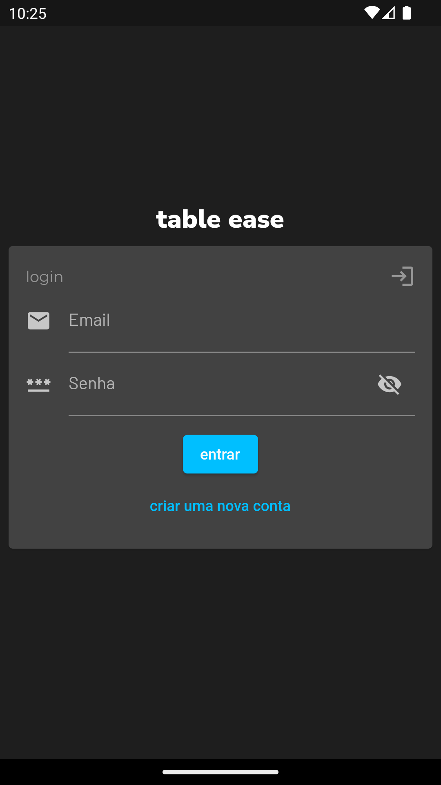
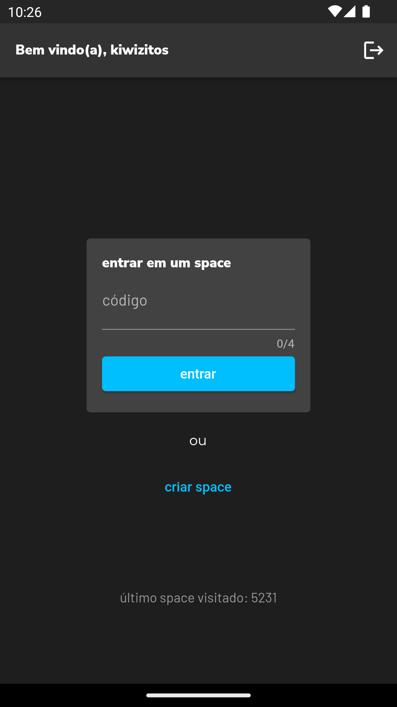
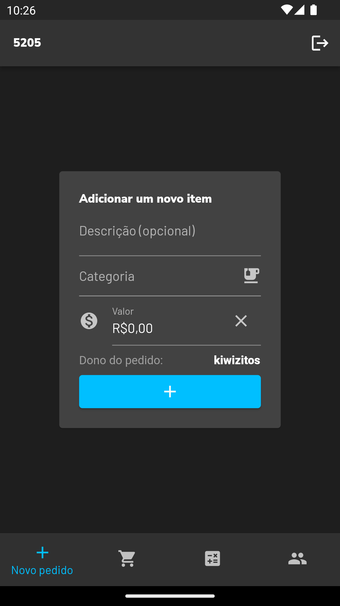
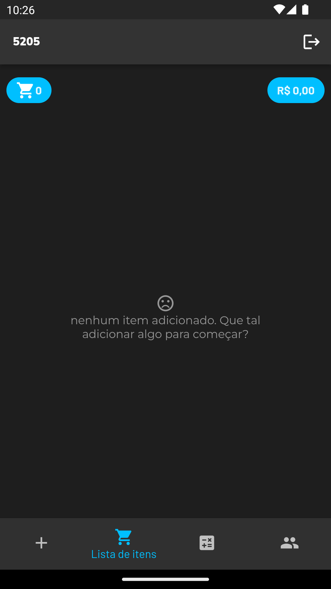
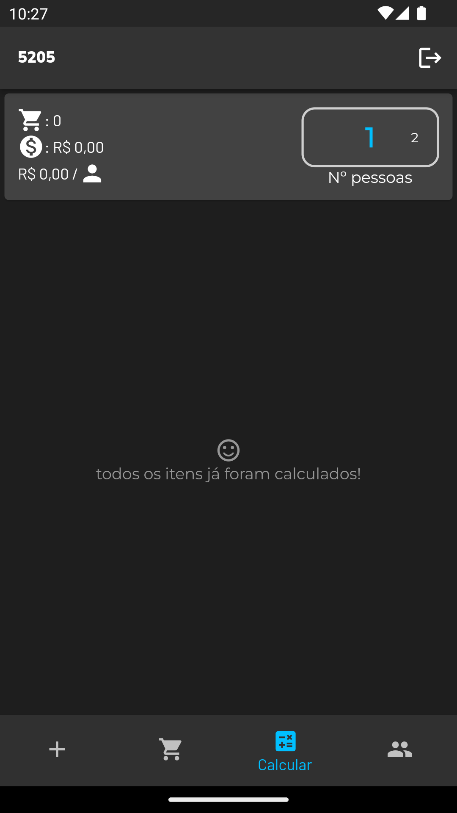
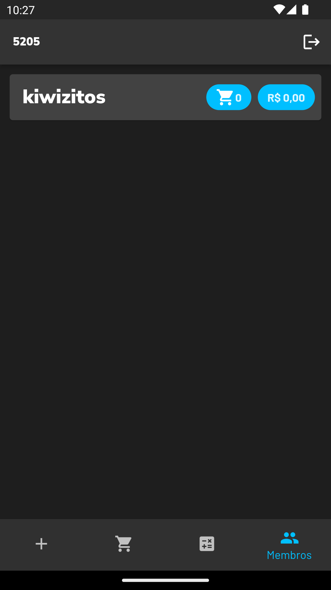

# table ease
[made by ](https://bit.ly/devRevo)

Chega de complicação na hora de dividir a conta, o table ease chegou para trazer autonomia nos seus pedidos.

[Conheça o projeto](https://bit.ly/tablease)

## Tecnologias
O projeto foi desenvolvido utilizando o Flutter na aplicação e o Firebase para o banco de dados.

## Prints

